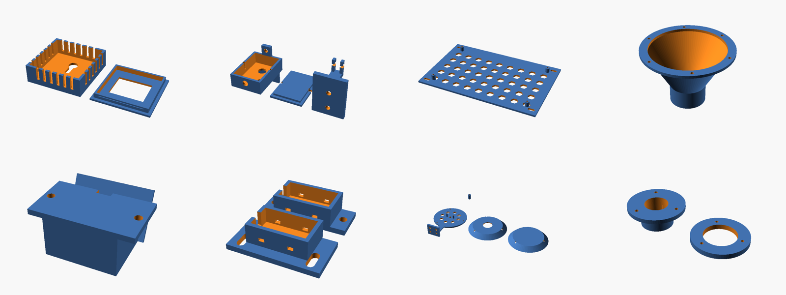

# 3D-Printed Parts

All parts are parametric **OpenSCAD** sources. Ready-to-print STLs are in `stl/`, and
`bash render.sh` regenerates them (it fails on any OpenSCAD error or empty mesh).

| STL | Qty | Source | What it's for | Material |
|---|---|---|---|---|
| `feeder_funnel_adapter` | 0–1 | `feeder_funnel_adapter.scad` | **Only for the optional metered auger:** hopper floor → 2" PVC auger tube funnel. Not needed with the default gravity feed bin | PETG |
| `camera_case`, `camera_lid`, `camera_bracket` | 1 each | `camera_mount.scad` | ESP32-CAM hood, lid and tilting wall bracket (optional camera) | ASA / PETG |
| `pir_housing` | 1 | `pir_mount.scad` | HC-SR501 PIR housing, tilted 30° down over the roosts | PETG |
| `ble_case_base`, `ble_case_lid` | 1 per sensor | `ble_sensor_case.scad` | Vented, peck-proof case for a LYWSD03MMC BLE thermometer | PETG |
| `shield_base` | 1 | `sensor_radiation_shield.scad` | Radiation-shield base + wall arm, cradles the BME280 | **White** ASA/PETG |
| `shield_louvre_x4` | 4 | 〃 | Louvre plates | White ASA/PETG |
| `shield_top` | 1 | 〃 | Solid top plate | White ASA/PETG |
| `shield_spacer_x12` | 12 | 〃 | 12 mm spacers on 3× M3 rods | Any |
| `reed_switch_bracket_x2` | 2 | `reed_switch_bracket.scad` | Door-frame reed switch mounts with 12 mm slot adjustment | PETG |
| `reed_magnet_holder_x2` | 2 | 〃 | Matching magnet holders on the door leaf | PETG |
| `ultrasonic_lid_mount` | 1 | `ultrasonic_lid_mount.scad` | JSN-SR04T probe gland + clamp ring for the feed-bin lid in the service station (32 mm hole) | PETG |
| `controller_backplate` | 1 | `controller_backplate.scad` | Mounts the 170×105 mm controller PCB in an IP65 box (200×130 mm plate) | PETG |

## Material and settings

- Use **PETG** for most parts. It tolerates the humidity and ammonia in a coop and doesn't
  soften in summer like PLA does. Use **ASA** for anything in direct sun (camera, radiation
  shield), because it's UV-stable.
- **Avoid PLA outdoors.** It creeps and gets brittle within a season in a hot coop.
- Default settings: 0.2 mm layers, 3–4 perimeters, 20–30% gyroid infill. No supports are
  needed if you print each part flat side down (noted in each `.scad` header).
- Before printing, measure the parts that vary between suppliers and edit the parameters
  at the top of the `.scad` file: ESP32-CAM board, HC-SR501 dome, JSN-SR04T diameter,
  reed-switch body, and the PVC OD for your pipe.

## Using a print service

No printer? Upload the STLs to any of these:

| Service | Notes |
|---|---|
| **JLC3DP** (jlcpcb.com/3d-printing) | Cheapest. Add the parts to the same order as the PCB to share shipping. Pick "PETG" or "ASA" under FDM |
| **Craftcloud** (craftcloud3d.com) | Price comparison across local print shops |
| **PCBWay 3D printing** | Also combine with the PCB order |
| **Local library / makerspace** | Often free or at cost |

Rough cost for the default set (no funnel) in PETG through a service: **$30–55**. The
back-plate accounts for most of it.
