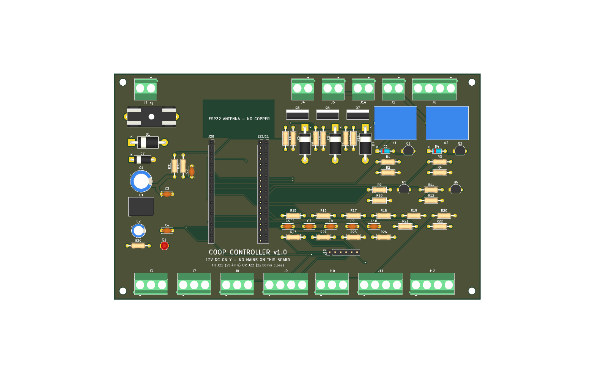

# Automated 50-Bird Chicken Coop

This is a complete, buildable design for a **10 × 20 ft coop for 50 free-ranging hens**:
the structure, run and paddocks, water and power, plus an **ESP32 + ESPHome controller**
that integrates with **Home Assistant**. Every subsystem starts **low-tech**, and the
automation is an upgrade you can add later.

> ⚠️ **Safety and code.** This project includes **120 V mains wiring outdoors** and a
> **load-bearing structure**. The plans are detailed, but they are **not** a substitute for
> a **licensed electrician** (all 120 V work, GFCI protection, inspection) or for your
> **local building department** (permit, setbacks, snow/wind loads). The controller PCB
> itself carries only 12 V DC.

| Coop | Controller PCB |
|---|---|
|  |  |

## What's here

| Folder | Contents | Checked by |
|---|---|---|
| [`PROJECT_SPEC.md`](PROJECT_SPEC.md) | Architecture, sizing, tiers, power design, **GPIO map** | consistency check |
| [`hardware/pinmap.yaml`](hardware/pinmap.yaml) | Single source of truth for GPIOs and terminals | consistency check |
| [`firmware/`](firmware/) | ESPHome configs: controller + optional ESP32-CAM | `esphome config` + full compile |
| [`pcb/`](pcb/) | KiCad 10 schematic + 2-layer board, generated from `design.py`, autorouted, Gerbers ready to order | ERC 0 · DRC 0 errors · 0 unrouted · schematic parity |
| [`3d-printing/`](3d-printing/) | 8 OpenSCAD designs → 15 STLs (feeder funnel, sensor housings, camera, brackets, PCB plate) | `render.sh` |
| [`construction/`](construction/) | Build plan + cut list, wiring, plumbing, run and range, 5 diagrams | diagrams regenerate from `pinmap.yaml` |
| [`docs/`](docs/) | [Priced parts list](docs/parts-list.md), [Home Assistant setup](docs/home-assistant.md), HA automations + dashboard | `gen_parts_list.py --check`, yamllint |
| [`tools/`](tools/) | `check_consistency.py`, `gen_parts_list.py` | CI |

## Cost (2026 estimates, see [parts list](docs/parts-list.md))

| Tier | Approx. |
|---|---:|
| Tier 1: coop, run, electric-netting paddocks, low-tech feed/water, power to the coop | ~$10.3k |
| Tier 2: full automation (controller, PCB, door actuator, water fill, auger, sensors) | ~$0.9k |
| Optional: camera, BLE sensors, battery backup | ~$0.15k |

The biggest levers on cost: lumber prices (±30 %), whether you need an electrician for the
feeder (about $900 is budgeted), and buying one electric netting roll instead of three.

## Tiers at a glance

| Subsystem | Tier 1 (works with no electronics) | Tier 2 (controller) |
|---|---|---|
| Pop door | Guillotine door + rope/pulley | 12 V actuator, on-device sunrise/civil-dusk schedule, reed confirmation, HA alerts |
| Water | 30 gal drum + nipples, hand-fill or mechanical float valve | Fail-closed solenoid, dual floats, timeout lockout, freeze-aware |
| Winter water | Heated waterer on the GFCI outlet | DS18B20-controlled de-icer / heat cable via SSR |
| Feed | 2 × 30 lb hanging feeders | Hopper + auger, twice daily, ultrasonic level, low-feed alert |
| Light | Switch | Morning supplement to 14 h day length |
| Ventilation | Soffit/ridge/gable/windows (≥ 20 sq ft) | 12 V fan on temp/RH |
| Security | Hardware cloth, buried apron, 2-step latches, electric netting | PIR night-motion alerts, door-open-after-dark alert, optional camera |

## Build order

1. **Plan and permit.** Read `PROJECT_SPEC.md` and `construction/coop-build-plan.md`. Check
   local code, snow/wind loads and setbacks. Get a lumber quote from the cut list.
2. **Site, foundation, floor, walls, roof** (`coop-build-plan.md` §2 steps 1–9).
3. **Predator proofing and openings.** Hardware cloth everywhere, apron, doors, windows,
   nest bay, roosts.
4. **Run and paddocks** (`run-and-fencing.md`).
5. **Water, Tier 1** (`plumbing.md`): drum, drinker line, supply chain.
   **Birds can move in now.** Keep them in the run for 1–2 weeks so they learn the coop is home.
6. **Power** (`wiring.md`). The electrician installs the feeder, mains box, lights and GFCI
   receptacle.
7. **Controller:** order the PCB (`pcb/fab/coop-controller-gerbers.zip`), print the parts
   (`3d-printing/stl/`), buy the Tier 2 parts, assemble and bring up the board
   (`pcb/README.md`), flash the firmware and adopt it in HA (`docs/home-assistant.md`).
8. **Commission one subsystem at a time:** door (adjust the reeds, watch a dusk close),
   then water fill, de-icer, feeder, lights, fan. Import the HA automations and dashboard.
9. **Optional:** camera, BLE thermometers, battery backup.

## Verify everything (what CI runs)

```bash
python tools/check_consistency.py      # pin map ↔ firmware ↔ PCB ↔ spec ↔ HA entity IDs ↔ schematic
python tools/gen_parts_list.py --check  # parts list totals are current
python construction/gen_diagrams.py     # diagrams regenerate
esphome config firmware/coop-controller.yaml
bash 3d-printing/render.sh
bash pcb/build.sh                       # needs KiCad 10 + Java + Freerouting: ERC/DRC/fab outputs
```

## Before building: check these by hand

These are the things software checks can't prove:

- [ ] **PCB:** open it in KiCad and review the autorouted layout. Confirm the SRD relay
      pinout on your parts, and your ESP32 board's row spacing (fit J21 for 25.4 mm or
      J22 for 22.86 mm). See `pcb/README.md`.
- [ ] **Firmware:** set your latitude/longitude/timezone and feeding times, and your BLE
      thermometer's MAC (or remove `packages/ble.yaml`).
- [ ] **3D parts:** measure your specific sensors and PVC and adjust the parameters in the `.scad` headers.
- [ ] **Structure:** check rafter size against your local snow load, and pull a permit if needed.
- [ ] **Electrical:** a licensed electrician does all 120 V work, with GFCI on everything.

## Design decisions

- **ESPHome** rather than Arduino/ESP-IDF: it's local-first, integrates natively with
  HA, and each entity is a few lines of YAML, which keeps the upgrade path cheap.
- **KiCad** rather than Eagle: it's free, it's scriptable (the board is generated and
  verified from `pcb/design.py`), and it outputs standard Gerbers for any fab.
- **Mains stays off the PCB.** The SSRs and PSU sit in a separate electrician-installed
  box. The PCB only switches the SSR inputs at 12 V.
