# Construction

| Document | Contents |
|---|---|
| [coop-build-plan.md](coop-build-plan.md) | Full 10 × 20 ft coop build: foundation → roof, cut list, nest bay, roosts, pop door, **exterior feed & water service station**, ventilation, maintenance |
| [wiring.md](wiring.md) | 120 V feeder + mains box (electrician), 12 V controller terminal-by-terminal wiring, load budget |
| [plumbing.md](plumbing.md) | Spigot → backflow → regulator → filter → solenoid → drum (in the exterior station) → through the wall → drinkers, float logic, winterising |
| [run-and-fencing.md](run-and-fencing.md) | 500 sq ft secure run, buried apron, rotational electric-netting paddocks |

## Renders

Illustrative OpenSCAD model (`model/coop_model.scad`). Regenerate with `bash model/render.sh`,
which needs a desktop OpenSCAD because PNG export uses OpenGL.

| | |
|---|---|
| 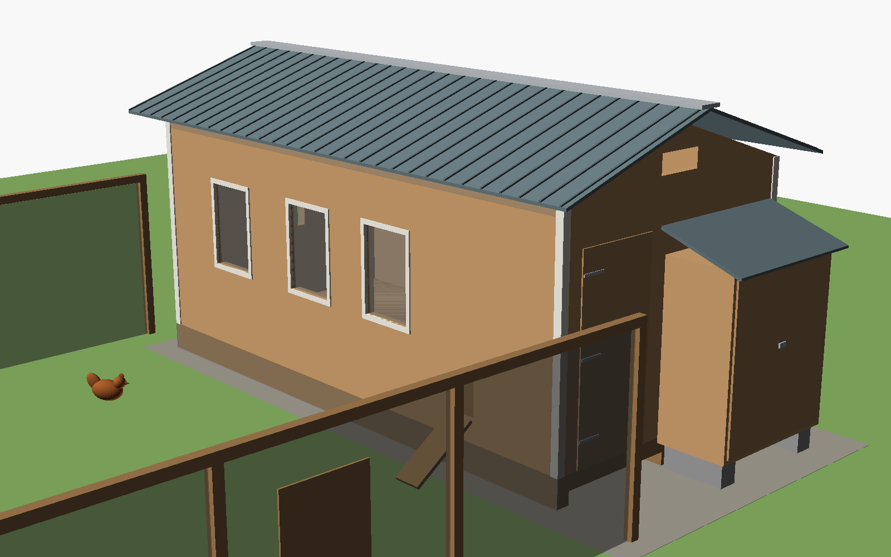 Exterior from the south-east: run, windows with shutters, service station | 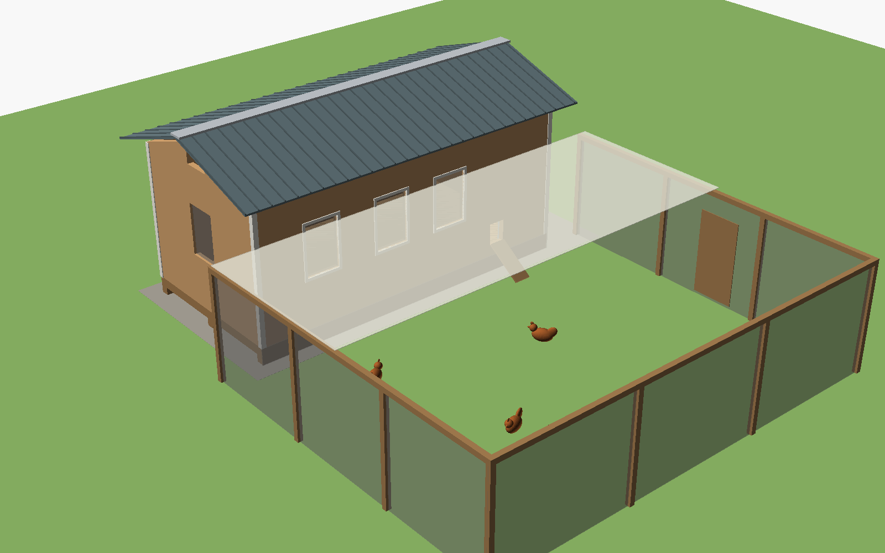 Overview with the secure run and shade sail |
| 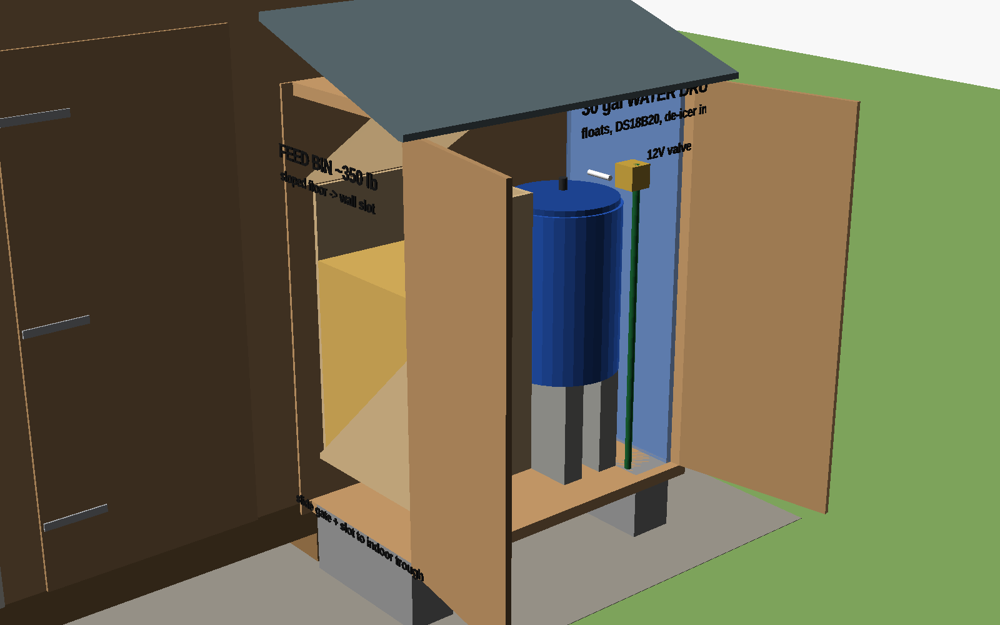 **Service station, doors open:** gravity feed bin (sloped floor to the wall slot), 30 gal drum, 12 V valve | 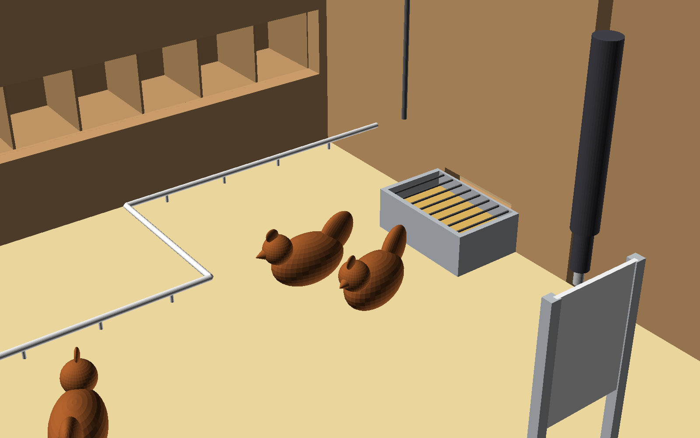 **Inside:** trough fed through the wall, nipple line from the exterior drum, pop door + actuator |
| 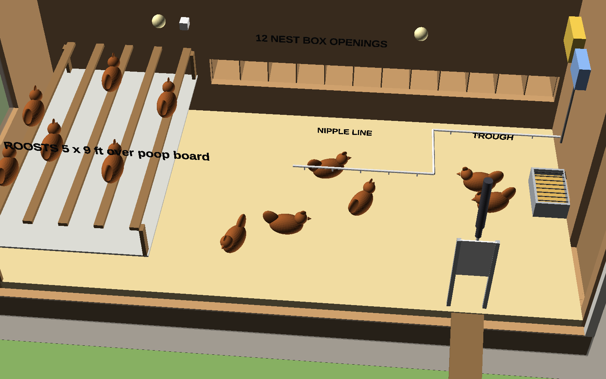 Interior cutaway: roosts over the poop board, nest openings, drinkers, trough, electrical boxes | 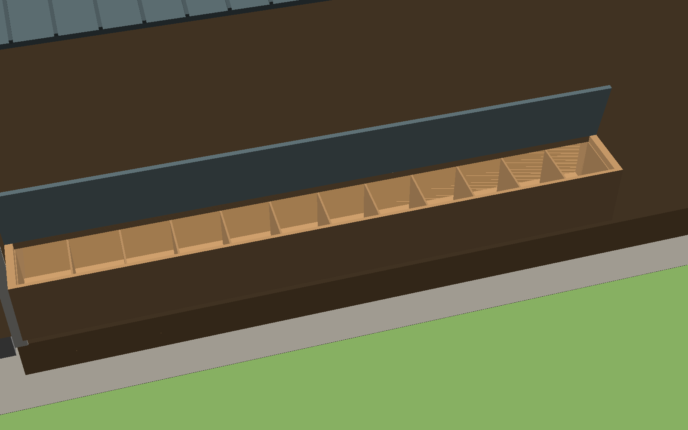 Nest bay with the lid open (eggs collected from outside) |

## Diagrams

`diagrams/` is generated by `gen_diagrams.py`; the wiring diagram reads
`hardware/pinmap.yaml`.

| | |
|---|---|
| 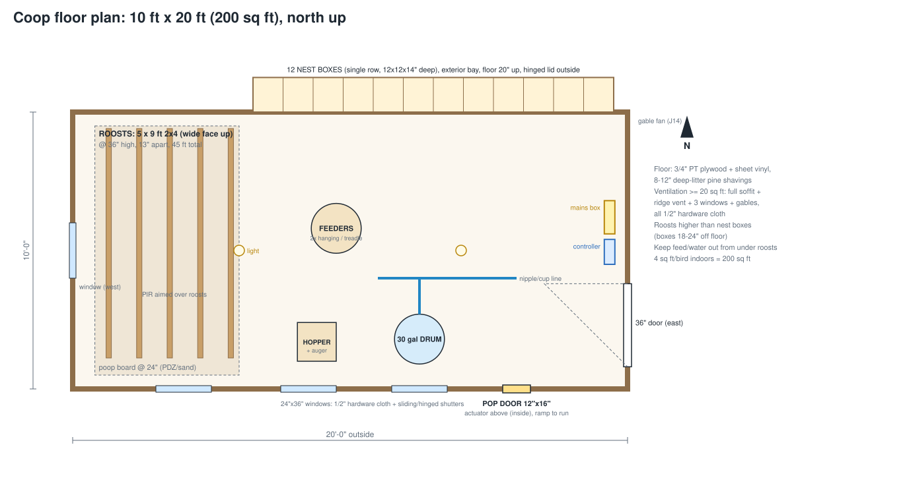 | 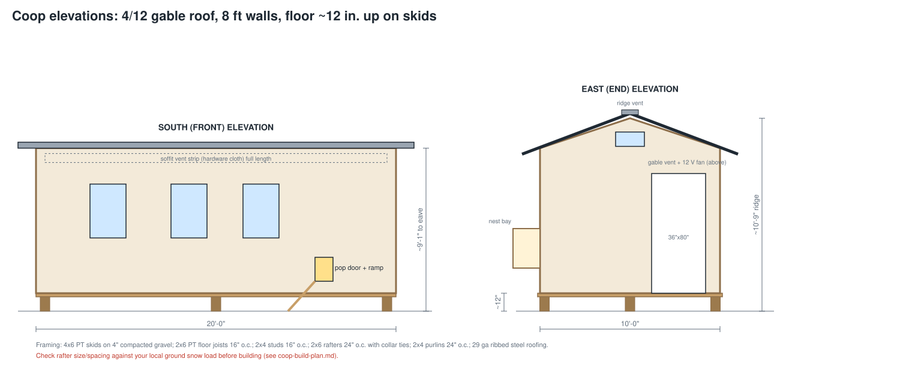 |
| 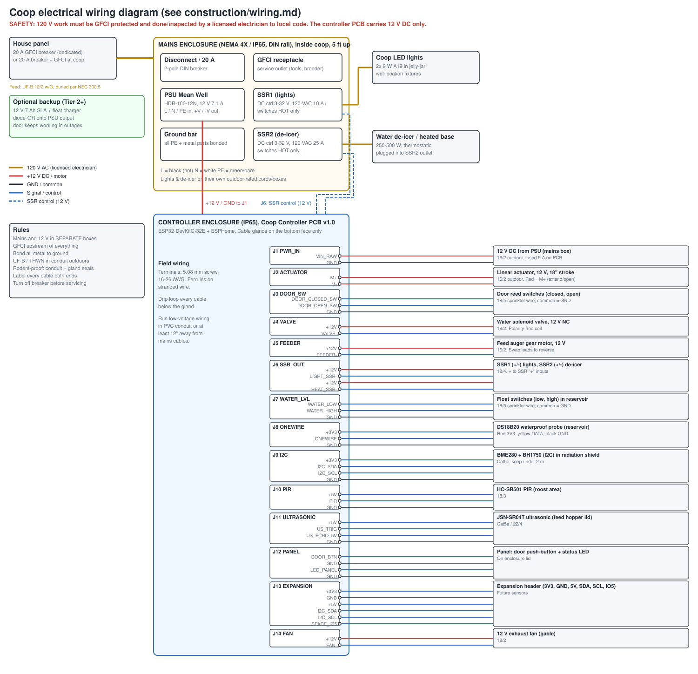 | 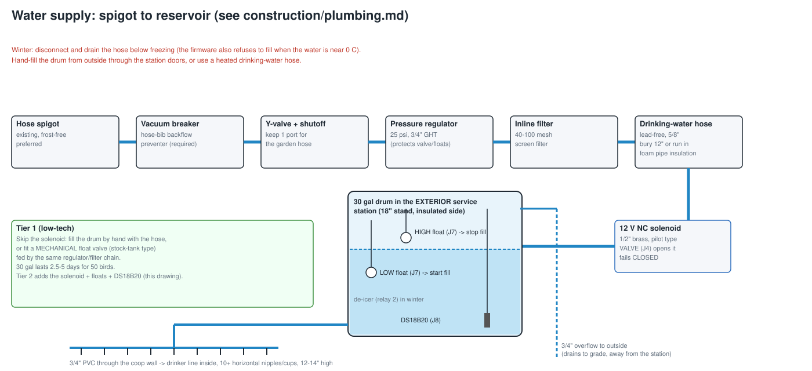 |
| 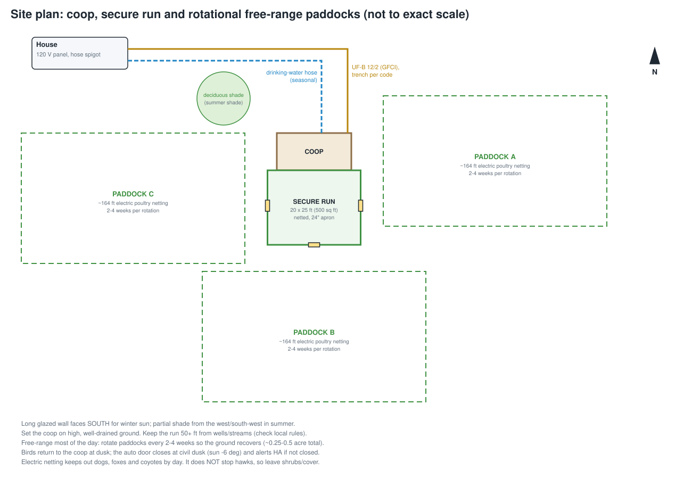 | |

> Structural and electrical work need local code review: get a permit if required,
> check the snow/wind loads, and have a licensed electrician do the 120 V side.
